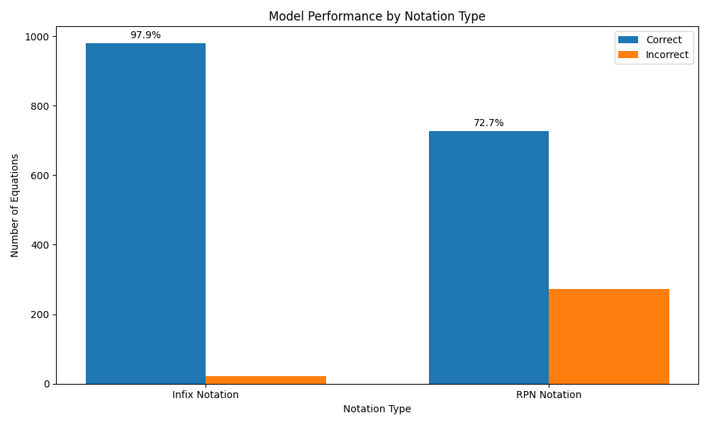

# RPN vs Infix Notation Evaluation

This project tests how well language models (specifically qwen2.5:0.5b running in Ollama) perform on mathematical equations presented in two different notations:

1. **Infix Notation**: Standard mathematical notation (e.g., `3 + 4 * 2`)
2. **Reverse Polish Notation (RPN)**: Postfix notation where operators follow operands (e.g., `3 4 2 * +`)

## Project Overview

The experiment:
1. Generates 1,000 random mathematical equations with varying complexity
2. Presents each equation to the model in both notations
3. Evaluates whether the model correctly calculates the result
4. Analyzes which notation results in better performance

## Setup and Requirements

1. Ensure you have Ollama installed and running locally
2. Ensure you have the qwen2.5:0.5b model pulled in Ollama
3. Install the required Python packages:

```bash
uv sync
```

## Running the Experiment

Simply run the main script:

```bash
uv run main.py
```

- The script will first show a sample equation in both notations
- You can then choose to run the full experiment with 1,000 equations
- You can also customize the number of equations to test

## Results


### Anslysis of Results
Although it seems like RPN fails, there likely is little to no training data based around RPN equations. If this is true, then models perform exceptionally well in comparison to infix. However, this case would need to be isolated by fine-tuning a model with a corpus of data containing many RPN examples.

Results are saved in two formats:
1. `results.json`: Contains detailed results for each equation tested
2. `results_comparison.png`: A visual comparison of model performance with both notations


## How It Works

### Equation Generation
- Randomly generates expression trees with operators (+, -, *, /, ^)
- Traverses the tree to produce both infix and RPN representations
- Ensures "tricky" equations that test PEMDAS understanding

### Model Testing
- Sends prompts to the Ollama API requesting calculation
- Searches response for the correct result

### Analysis
- Calculates accuracy percentages for both notation types
- Visualizes the results for easy comparison

## Next Steps
Since the corpus for Llama 3.2 or Qwen 2.5 are unlikely to contain much if any RPN equations and answers, the next steps are to compare a fine tuned model trained on a corpus of RPN equations, answers and steps to solve.
